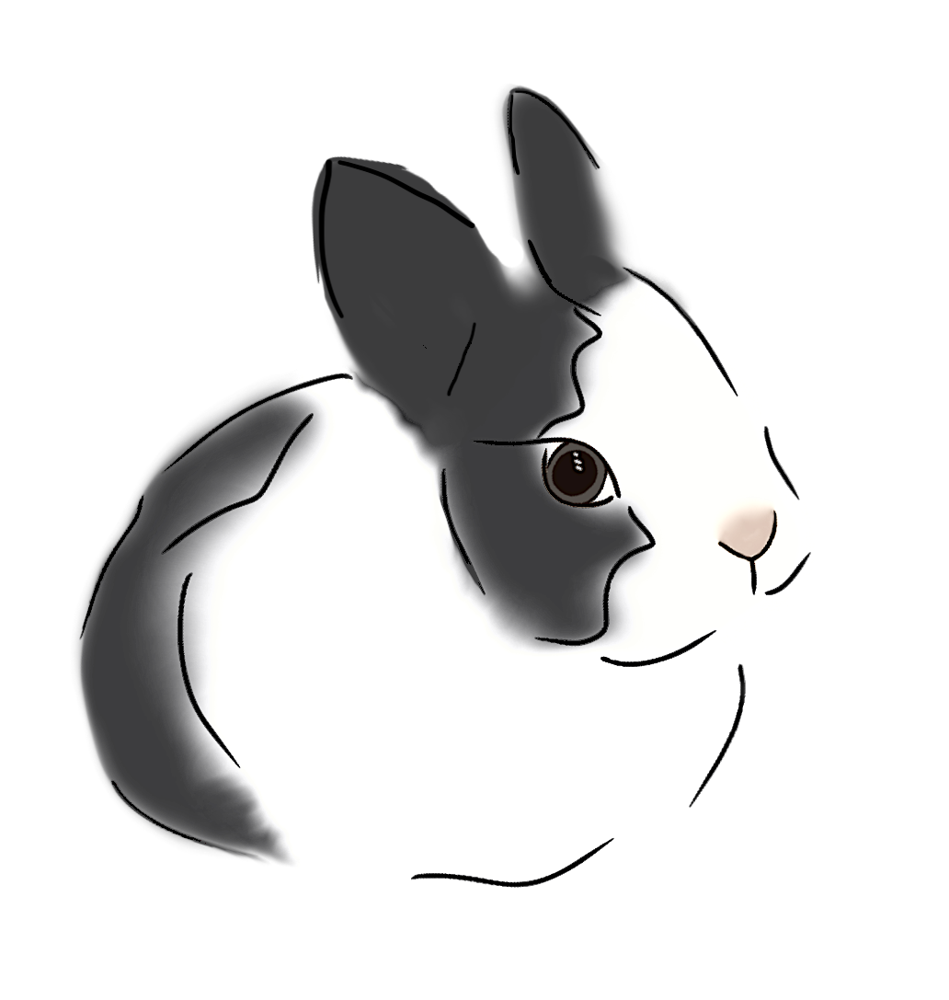

# bunny-dive
<p align="center">
  
</p>

<h1 align="center">Bunny Dive</h1>

<p align="center">
  <a href="https://bunnydive.pages.dev">bunnydive.com</a>
</p>

<p align="center">
  <em>Go down the rabbit hole. Start with any topic, follow the trail, see where it leads.</em>
</p>

---

## What is Bunny Dive?

Bunny Dive is a small web app for wandering through Wikipedia on purpose.

You type in a topic (say, *Black hole* or *Renaissance*) and Bunny Dive shows you a short summary of it, plus a handful of closely related topics drawn as a branching map. Pick one, and it opens up with its own summary and its own set of connections. Keep going. After 14 topics you reach the bottom of the hole and get a numbered list of the whole path you took.

### How to use it

1. **Start.** Type a topic on the home screen and press the triangle button.
2. **Read.** The side panel shows the topic's summary. The map shows where you are and where you can go next.
3. **Choose your next hop.** Click a topic in the side panel or click a dashed node directly on the map.
4. **Go back.** Click any node you've already visited, or press its number in the footer trail.
5. **Switch language.** Press `TR` / `EN` in the header. Every topic on the map is translated to its equivalent article in the other language.
6. **Finish or leave.** Reach 14 topics and you get your journey summary, or press **Exit** in the header to go back to the start whenever you like.

---

## Getting started

**Requirements:** Node.js 18 or newer.

```bash
git clone <your-repo-url>
cd bunny-dive
npm install
npm run dev
```

---

## How it works (technical)

### Stack

| Piece | Choice |
| --- | --- |
| UI | React 18 |
| Build tool | Vite 6 |
| Graph rendering | [React Flow](https://reactflow.dev) (`@xyflow/react` 12) |
| Graph layout | [dagre](https://github.com/dagrejs/dagre) (`@dagrejs/dagre`) |
| Data | The public MediaWiki API (English and Turkish Wikipedia) |
| Hosting | Cloudflare Pages |

There is no backend, no database, and no API key. The whole app is a static bundle that talks directly to Wikipedia from the browser.

### Fetching a topic

Each time you open a topic, two requests go out in parallel to `https://{lang}.wikipedia.org/w/api.php`:

- **Summary:** `prop=extracts` with `exintro`, `explaintext`, and `exsentences=3`, giving the first three sentences of the article as plain text.
- **Links:** `prop=links` restricted to the main article namespace (`plnamespace=0`, up to 500 links).
Requests use `origin=*` so the browser can call the API directly. The raw link list is then handed to the ranking step.

### Ranking and sorting

A Wikipedia article can link to hundreds of pages, and most of them are noise (years, citation identifiers, list pages). Showing all of them would be useless, so `scoring.js` narrows them to the six best in two stages.

**Score.** Every remaining link starts at 1 point and earns bonuses:

| Signal | Points |
| --- | --- |
| Base score | +1 |
| The link's title appears in the topic's summary | +5 |
| The link's title contains a meaningful word (longer than 3 characters) from the current topic's title | +3 |

---

## Design

Bunny Dive's interface takes its cues from **minimalist Bauhaus design**: form follows function, geometric shapes, a limited flat palette, and bold type. Nothing is decorative unless it also communicates something.

**Typography.** Headings are set in **Archivo Black** and body text in **Archivo**. Section labels are small, uppercase, and letter-spaced.

**The logo.** The bunny is hand-drawn by me. It is the only organic shape in an otherwise geometric interface; a soft, curious little animal set against a strict grid.

---


## Deployment: Cloudflare Pages

Bunny Dive is hosted on **Cloudflare Pages**.

---
